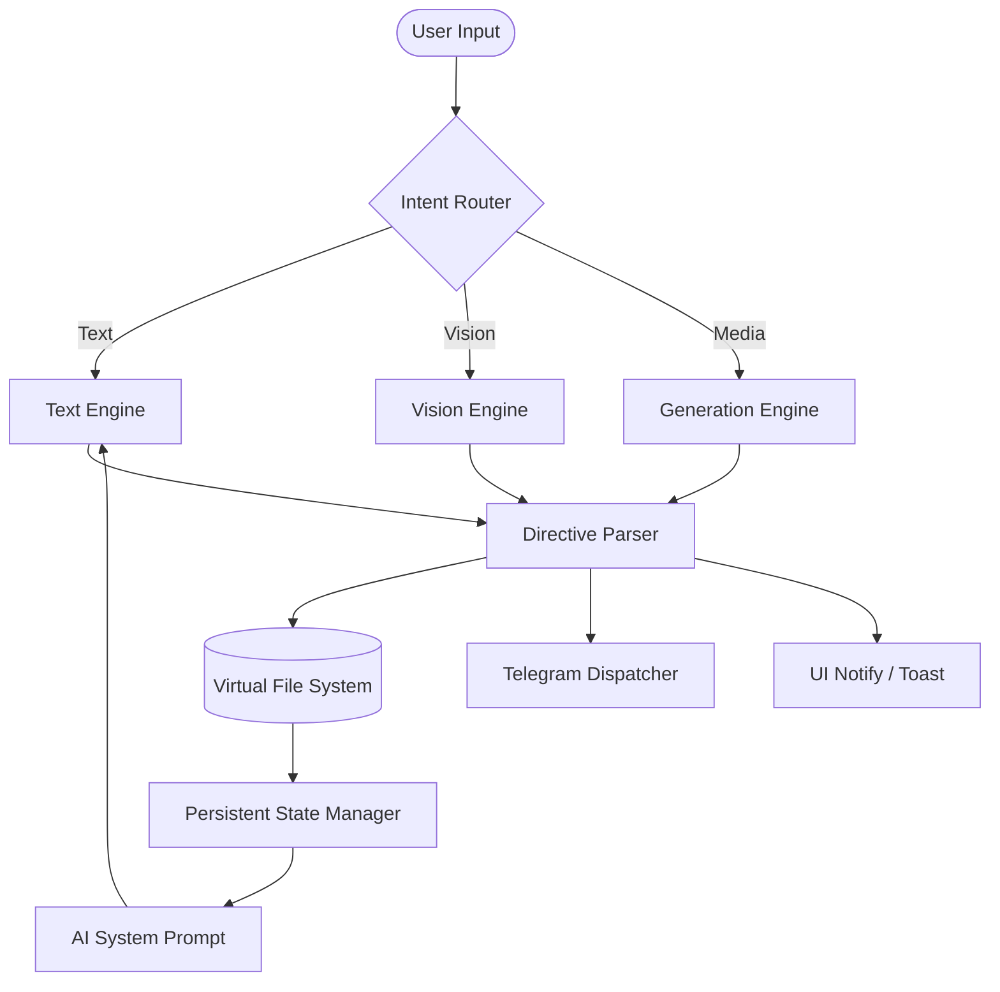

<div align="center">
  
  <h1>KREASYS</h1>
  <p><strong>Autonomous Browser-Native IDE & Multi-Modal AI Ecosystem</strong></p>

  <p>
    <a href="https://github.com/KREASIOKA/KREASYS/stargazers">
      
    </a>
    <a href="https://github.com/KREASIOKA/KREASYS/graphs/contributors">
      
    </a>
  </p>

  <p>
    
    
    
    
    
    
    
  </p>
</div>

---

###  Notice: Early Development Alpha
> **Disclaimer:** We sincerely apologize for the current lack of comprehensive documentation. **KREASYS** is in its very early alpha stages of development. Features are currently minimal, the codebase is rapidly evolving, and bugs are to be expected. We appreciate your patience and contributions!

---

##  Navigation
- [What is KREASYS?](#what-is-kreasys)
- [System Architecture](#system-architecture)
- [How It Works](#how-it-works)
- [Core Components](#core-components)
- [Quick Start](#quick-start)
- [Contributors](#contributors)

---

##  What is KREASYS?
Developed by the **KREASIOKA team** ([www.kreasioka.com](https://www.kreasioka.com)), **KREASYS** is a hyper-modular, browser-native IDE designed for autonomous AI interaction. It allows AI agents to operate within a sandboxed Virtual File System (VFS), creating and editing files while maintaining a persistent memory loop—all without a server backend.

### Key Capabilities
- **Browser-Native VFS:** Persistent hierarchical storage using IndexedDB (`localforage`).
- **Multi-Modal Routing:** Intent-based model selection (Text, Image, Audio, Video).
- **Autonomous Delegation:** Background-polling Telegram bot support for remote interaction.
- **Visual Task Tracking:** Live execution flowcharts rendered via AI plan parsing.

---

##  System Architecture
KREASYS follows a reactive, event-driven architecture that separates state persistence from UI rendering.



---

##  How It Works
The core logic resides in a high-speed inference loop that injects the current state of the VFS into every AI thought process.

1. **State Initialization (`state.js`):** Loads saved configuration, persona directives, and VFS data from local storage.
2. **Context Assembly:** Aggregates file contents from `/workspace/` and system logs into a structured context window.
3. **Intent-Model Mapping (`ai.js`):** The `route()` function analyzes the query to select the most efficient model for the task.
4. **Directive Parsing (`vfs.js`):** The engine monitors AI output for structural tags.
   - `<file path="...">` triggers atomic VFS writes.
   - `<tg_send chat_id="...">` initiates autonomous external messaging.
   - `<plan>` tags drive the visual flowchart animations.

---

##  Internal Core Documentation

### 1. State Management (`js/core/state.js`)
This is the application's central nervous system. It handles:
- **`st` Object:** Global reactive state containing configuration, model lists, and VFS pointer.
- **`ld()` function:** Asynchronous bootloader that restores environment parity from `IndexedDB`.
- **`svGlb()` function:** Atomic synchronization of state to storage.

### 2. Virtual File System (`js/core/vfs.js`)
Manages the memory-mapped file tree.
- **`psVfs(ctx)`:** Regex-based parser that intercepts and executes file-write instructions from the LLM.
- **`rVfs()`:** Recursive UI renderer that builds the nested folder hierarchy seen in the Workspace tab.
- **`buildVfsContext()`:** Serializes the current workspace into a format readable by the AI.

### 3. AI Inference Loop (`js/core/ai.js`)
Handles communication and autonomous behavior.
- **`llm(p, u, mod)`:** High-level abstraction for vendor-agnostic API calls (OpenRouter, Groq, NVIDIA).
- **`xc(q, isC)`:** The execution controller. It orchestrates routing, prompt construction, parsing, and UI feedback for a single interaction.

---

##  Quick Start
Since KREASYS is strictly client-side, you only need a local static server to bypass CORS restrictions during development.

```bash
# Clone the repository
git clone https://github.com/KREASIOKA/KREASYS/

# Serve locally
python3 -m http.server 8080
```
Open `http://localhost:8080` and enter your API keys in the **Models** tab.

---

##  Contributors
We welcome contributions from the developer community to advance browser-native AI!

<div align="center">
  <a href="https://github.com/KREASIOKA/KREASYS/graphs/contributors">
    
  </a>
</div>

<p align="center">
  <i>Maintained by the <b>KREASIOKA Team</b></i><br>
  <a href="https://www.kreasioka.com">www.kreasioka.com</a>
</p>
