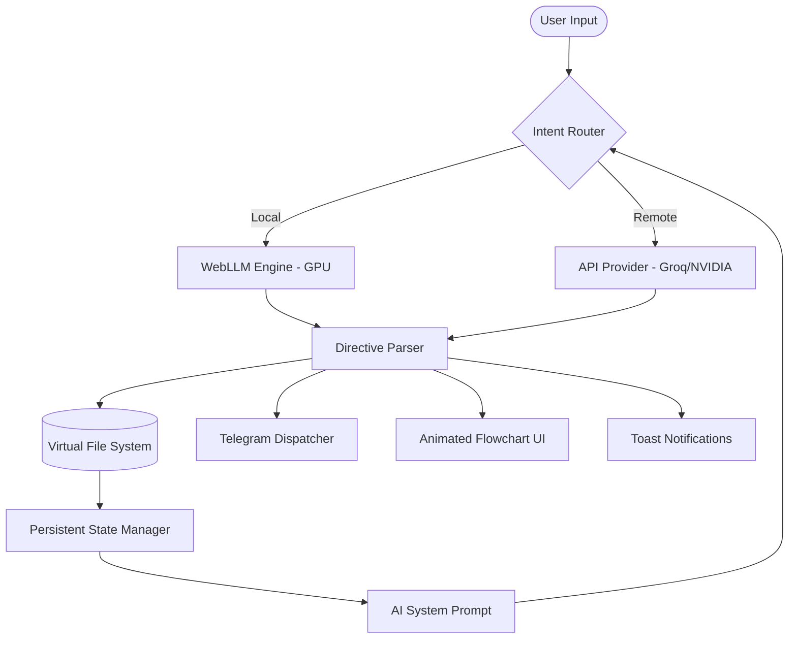

<div align="center">
  
  <br>
  
  <h1>KREASYS</h1>
  <p><strong>Autonomous Browser-Native IDE & Multi-Modal AI Ecosystem</strong></p>

  <p>
    <a href="https://github.com/KREASIOKA/KREASYS/stargazers">
      
    </a>
    <a href="https://github.com/KREASIOKA/KREASYS/graphs/contributors">
      
    </a>
    <a href="https://www.linkedin.com/company/kreasioka/">
      
    </a>
  </p>

  <p>
    
    
    
    
    
  </p>
</div>

---

### Notice: Early Development Alpha
> **Disclaimer:** We sincerely apologize for the current lack of comprehensive documentation. **KREASYS** is in its very early alpha stages of development. Features are currently minimal, the codebase is rapidly evolving, and bugs are to be expected. We appreciate your patience and contributions!

---

## Navigation
- [What is KREASYS?](#what-is-kreasys)
- [System Architecture](#system-architecture)
- [WebLLM and Local AI](#webllm-and-local-ai)
- [How It Works](#how-it-works)
- [Core Components](#core-components)
- [Quick Start](#quick-start)
- [Contributors](#contributors)

---

## What is KREASYS?
Developed by the **KREASIOKA team** ([www.kreasioka.com](https://www.kreasioka.com)), **KREASYS** is a hyper-modular, browser-native IDE designed for autonomous AI interaction. It allows AI agents to operate within a sandboxed Virtual File System (VFS), creating and editing files while maintaining a persistent memory loop—all without a server backend.

### Key Capabilities
- **Browser-Native VFS:** Persistent hierarchical storage using IndexedDB (localforage).
- **WebLLM Local Inference:** Run powerful LLMs (Llama 3, Phi 3, etc.) entirely in your browser via WebGPU—**no API keys required**.
- **Multi-Modal Routing:** Intent-based model selection (Text, Image, Audio, Video).
- **Autonomous Delegation:** Background-polling Telegram bot support for remote interaction.
- **Visual Task Tracking:** Live execution flowcharts rendered via AI plan parsing.

---

## System Architecture
KREASYS follows a reactive, event-driven architecture that separates state persistence from UI rendering.



---

## WebLLM and Local AI
KREASYS features a full **Model Library Manager** that leverages the **WebLLM** library.

- **Private and Offline:** Once downloaded, models run entirely on your local GPU.
- **Model tiers:** Supports models from 100M (Tiny) to 9B (Large) parameters.
- **Tracking:** Monitor download progress, delete cached models, and test engine availability directly from the UI.
- **Cache Management:** Models are stored in the browser's Cache Storage API for instant subsequent loads.

---

## How It Works
The core logic resides in a high-speed inference loop that injects the current state of the VFS into every AI thought process.

1. **State Initialization (state.js):** Loads saved configuration, persona directives, and VFS data from local storage.
2. **Context Assembly:** Aggregates file contents from /workspace/ and system logs into a structured context window.
3. **Intent-Model Mapping (ai.js):** The route() function analyzes the query to select the most efficient model for the task.
4. **Directive Parsing (vfs.js):** The engine monitors AI output for structural tags.
   - `<file path="...">` triggers atomic VFS writes.
   - `<tg_send chat_id="...">` initiates autonomous external messaging.
   - `<plan>` tags drive the visual flowchart animations.

---

## Core Components

### 1. State Management (js/core/state.js)
This is the application's central nervous system. It handles the `st` global object and ensures atomic synchronization to localforage.

### 2. Local AI Engine (js/core/webllm.js)
Manages the WebGPU inference lifecycle, model library rendering, and cache deletion logic.

### 3. Virtual File System (js/core/vfs.js)
Manages the memory-mapped file tree and serializes the workspace for AI context injection.

### 4. Telegram Integration (js/core/telegram.js)
Handles long-polling, file attachments (images/docs), and autonomous multi-media dispatches.

---

## Quick Start
Since KREASYS is strictly client-side, you only need a local static server to bypass CORS restrictions during development.

```bash
# Clone the repository
git clone https://github.com/KREASIOKA/KREASYS/

# Serve locally
python3 -m http.server 8080
```
Open http://localhost:8080 and enter your API keys or download a local model in the **Models** tab.

---

## Contributors
We welcome contributions from the developer community to advance browser-native AI!

<div align="center">
  <a href="https://github.com/KREASIOKA/KREASYS/graphs/contributors">
    
  </a>
</div>

<p align="center">
  <i>Maintained by the <b>KREASIOKA Team</b></i><br>
  <a href="https://www.kreasioka.com">www.kreasioka.com</a><br>
  <a href="https://www.linkedin.com/company/kreasioka/">LinkedIn</a>
</p>
