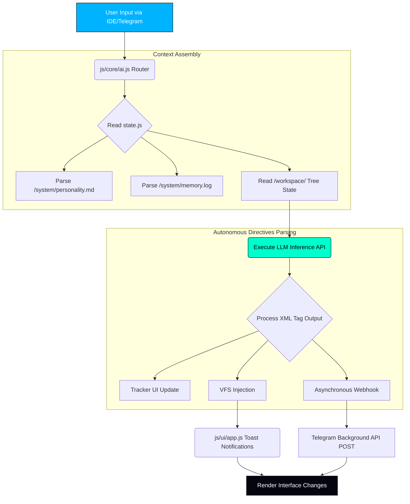

<div align="center">
  
  
  <br/>
  <h1>
     
    KREASYS Core Framework
  </h1>
  <p><strong>Autonomous Browser-Native IDE & Multi-Modal Artificial Intelligence</strong></p>
  
  <p>
    <a href="https://github.com/KREASIOKA/KREASYS/stargazers">
      
    </a>
    <a href="https://github.com/KREASIOKA/KREASYS/graphs/contributors">
      
    </a>
    <a href="https://www.kreasioka.com">
      
    </a>
  </p>

  <p>
    <a href="https://github.com/KREASIOKA/KREASYS/"></a>
    <a href="#"></a>
    <a href="#"></a>
  </p>
</div>

---

> **Notice: Early Alpha Development & Missing Documentation**
> 
> We sincerely apologize for the lack of inline code comments and comprehensive documentation available in the raw source files. KREASYS is strictly in its **early alpha stage of development**. Features are currently minimal, and there are known bugs that need to be resolved by the community. We deeply appreciate your patience and contributions as we stabilize the core codebase.

---

## Table of Contents
- [About KREASYS](#about-kreasys)
- [Technology Stack](#technology-stack)
- [System Architecture Flowchart](#system-architecture-flowchart)
- [Core Code Documentation](#core-code-documentation)
- [Getting Started](#getting-started)
- [Contributors](#contributors)

---

## About KREASYS

Developed by the [KREASIOKA Team](https://www.kreasioka.com), **KREASYS** is a 100% browser-native AI agent and Integrated Development Environment (IDE). 

By eliminating the need for a dedicated backend server node, KREASYS successfully leverages your local browser sandbox, an IndexedDB-backed Virtual File System (VFS), and API-driven Multi-Modal LLM routing to function as a fully autonomous personal software assistant. It is capable of iteratively writing and modifying code, tracking its own execution paths visually, and autonomously dispatching external communications to platforms such as Telegram.

---

## Technology Stack

<div align="center">
  
  
  
  
  
  
  
  
</div>

*   **Zero-Backend Execution:** The entire engine runs strictly client-side via JavaScript modules.
*   **Persistent File System:** Mapped natively to IndexedDB via `localForage`.
*   **Apple-Glass UI:** Highly optimized custom CSS overlaid on foundational Tailwind resets.

---

## System Architecture Flowchart

To compensate for the lack of inline codebase comments, below is an architectural flowchart illustrating the autonomous capability loop of the KREASYS engine:



---

## Core Code Documentation

Because the raw `.js` files are minified or lack detailed comments, please reference this documentation guide to understand how the core files construct the application.

### `js/core/state.js`
The central nervous system of KREASYS. 
*   **Responsibility:** Initializes the `st` (state) object. It handles the `localForage` IndexedDB schema, saving and loading the Virtual File System (VFS), application configs, and the Multi-Model API parameters.
*   **Key Functions:** `ld()` (Loads persisted state on boot), `svGlb()` (Saves global state to disk), `genId()` (Generates unique hashes).

### `js/core/ai.js`
The autonomous inference brain.
*   **Responsibility:** Intercepts strings from the user or webhook, builds the massive context payload (Personality + Skills + VFS Data), and dispatches `fetch` POST requests to the user's configured LLM (e.g. OpenRouter).
*   **Routing Logic:** The `route(q)` function parses keywords (e.g., "draw", "speak") to seamlessly swap from text-inference to Multimodal, Vision, or Image generation models.

### `js/core/vfs.js`
The file system virtualization layer.
*   **Responsibility:** Parses the XML payload outputs `<file path="...">` emitted by the AI, validates the sandboxing constraint to ensure changes only affect `/workspace/`, and pushes string data into the visual DOM tree.
*   **Key Functions:** `rVfs()` runs recursively to translate flat paths (e.g. `/workspace/css/main.css`) into the nested DOM folders visible on the far left of the Workspace tab.

### `js/core/telegram.js`
The asynchronous human-proxy communicator.
*   **Responsibility:** Operates a webhook-free (`tgPoll()`) fetch loop against the Telegram Bot API. It logs known User IDs who converse with the bot into the state memory.
*   **Autonomy:** Parses `<tg_send chat_id="...">` payloads outputted by the AI to securely and asynchronously update external humans in parallel to standard IDE execution.

### `js/ui/app.js`
The DOM presentation coordinator.
*   **Responsibility:** Captures click listeners for the main navigation, manages the dynamic sliding Toast notifications upon file creation, and parses `<plan>` tags to render the pulsing neon flowchart steps in the SysLog terminal.

---

## Getting Started

Because KREASYS requires no complex backend environments, deployment on your local machine is nearly instantaneous.

```bash
# 1. Clone the repository
git clone https://github.com/KREASIOKA/KREASYS.git

# 2. Navigate to the project directory
cd KREASYS

# 3. Serve the directory to bypass browser CORS restrictions
python3 -m http.server 8080
```
Access the application by pointing your browser to `http://localhost:8080`. Bind your API access keys within the **Models** graphical tab to initialize the autonomous engine.

---

## Contributors

We warmly welcome pull requests and issue submissions to accelerate the rapid development of KREASYS! 

<div align="center">
  <a href="https://github.com/KREASIOKA/KREASYS/graphs/contributors">
    
  </a>
  
  <br/><br/>
  <i>Built, designed, and maintained by the <a href="https://www.kreasioka.com">KREASIOKA Team</a>.</i>
</div>
