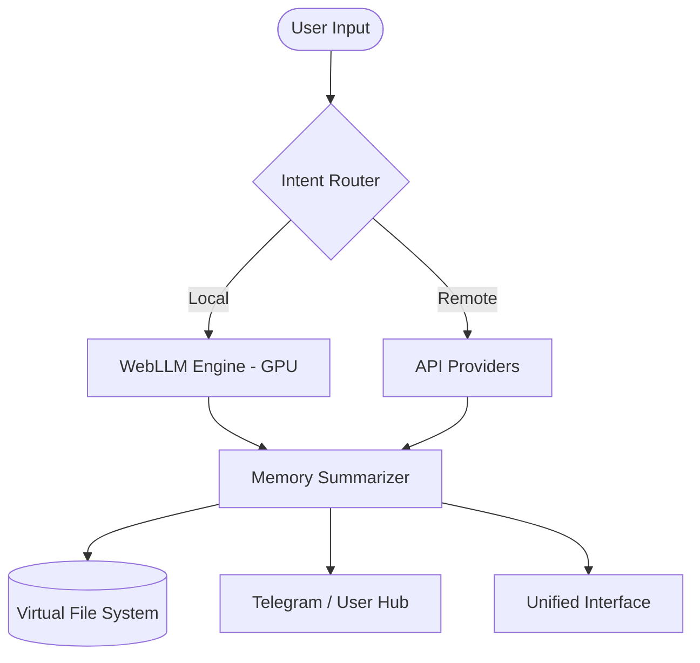

<div align="center">
  
  <br>
  
  <h1>KREASYS</h1>
  <p><strong>Autonomous Browser-Native IDE & Multi-Modal AI Ecosystem</strong></p>

  <p>
    <a href="https://github.com/KREASIOKA/KREASYS/stargazers">
      
    </a>
    <a href="https://github.com/KREASIOKA/KREASYS/graphs/contributors">
      
    </a>
    <a href="https://www.linkedin.com/company/kreasioka/">
      
    </a>
  </p>

  <p>
    
    
    
    
    
  </p>
</div>

---

###  Notice: Early Development Alpha
> **Disclaimer:** KREASYS is currently in its early alpha stages of development. Features are evolving rapidly, and the codebase is subjected to significant changes. We appreciate your technical contributions and feedback during this phase.

---

##  Navigation
- [What is KREASYS?](#what-is-kreasys)
- [System Architecture](#system-architecture)
- [Local AI Ecosystem](#local-ai-ecosystem)
- [Self-Modifying Memory](#self-modifying-memory)
- [Telegram Autonomous Hub](#telegram-autonomous-hub)
- [Core Components](#core-components)
- [Quick Start](#quick-start)

---

##  What is KREASYS?
Developed by the **KREASIOKA team**, **KREASYS** is a hyper-modular, browser-native IDE designed for autonomous AI interaction. It allows AI agents to operate within a sandboxed Virtual File System (VFS), creating and editing files while maintaining a persistent memory loop—all without a server backend.

###  Key Capabilities
- **Browser-Native VFS:** Persistent hierarchical storage using IndexedDB (localforage) for secure, local-first development.
- **WebLLM Dedicated Engine:** Run powerful LLMs (Llama 3.1, Phi 3, etc.) entirely on your local GPU via WebGPU.
- **Smart Memory System:** Automatic summarization of logs into persistent memory to prevent context bloat.
- **Autonomous Delegation:** Full Telegram integration with cross-user messaging and automated task execution.
- **Multi-Modal Routing:** Intent-based model selection (Text, Image, Audio, Video, Vision).

---

##  System Architecture
KREASYS follows a reactive, event-driven architecture that separates state persistence from UI rendering.



---

##  Local AI Ecosystem
KREASYS features a dedicated **Local AI** tab that leverages the **WebLLM** library for true privacy and speed.

- **Private & Metadata-Secure:** Once downloaded, models run entirely on your local GPU with no external data leakage.
- **Hardware Acceleration:** Full WebGPU utilization for near-native inference speeds in the browser.
- **Model Library:** Manage Llama, Phi, Gemma, and Mistral families directly from the UI.
- **Seamless Loading:** Models are cached in the browser's Cache Storage API for instant subsequent use.

---

##  Self-Modifying Memory
The V2 memory system introduces a dual-layer architecture to handle long-running autonomous tasks:

1. **Memory Log (`/system/memory.log`):** Raw session activity used for immediate context.
2. **Persistent Memory (`/system/memory.md`):** AI-summarized facts, user preferences, and key progress.
- **Autonomous Summarization:** When idle, the system automatically compresses the raw log into the persistent memory file, clearing the log to maintain high-quality context and prevent hallucinations.

---

##  Telegram Autonomous Hub
The Telegram integration allows KREASYS to act as a 24/7 autonomous employee.

- **User Directory:** Automatically registers everyone who interacts with the bot.
- **Cross-User Messaging:** One user can instruct the AI to contact another user via the directory.
- **Multi-Media Support:** Process and send images, documents, and audio autonomously.
- **Remote VFS Access:** Edit and view your workspace files via Telegram commands.

---

##  Core Components

### 1. State Management (`js/core/state.js`)
The application's central nervous system. It handles the `st` global object and coordinates atomic synchronization.

### 2. Autonomous Memory (`js/core/memory.js`)
Manages the idle-time summarization loop and the dual-layer context injection logic.

### 3. Native IDE Engine (`js/core/vfs.js`)
Manages the memory-mapped file tree and provides the AI with a structured view of the workspace.

---

##  Quick Start
KREASYS is strictly client-side. You only need a local static server to bypass CORS during development.

```bash
# Clone the repository
git clone https://github.com/KREASIOKA/KREASYS/

# Serve locally (WebGPU requires localhost/HTTPS)
python3 -m http.server 8080
```
Open `http://localhost:8080` to begin. Configure your models in the **Models** and **Local AI** tabs.

---

##  Contributors
We welcome contributions to advance the frontier of browser-native AI!

<div align="center">
  <a href="https://github.com/KREASIOKA/KREASYS/graphs/contributors">
    
  </a>
</div>

<p align="center">
  <i>Maintained by the <b>KREASIOKA Team</b></i><br>
  <a href="https://www.kreasioka.com">www.kreasioka.com</a><br>
  <a href="https://www.linkedin.com/company/kreasioka/">LinkedIn</a>
</p>
